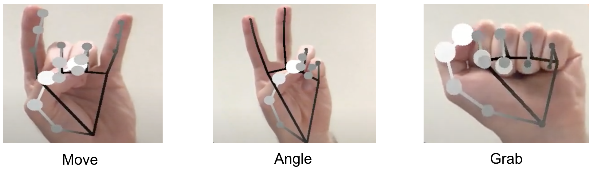

# MediaPipe: Video-Touch edition

<div align="center">
    <div align="center">
        
    </div>
    <div align="center"><b>
        <a href="https://github.com/google/mediapipe">MediaPipe</a> fork with hand gesture recognition and message passing to other software.
    </b></div>
    <div align="center"><b>
        <a href="https://dl.acm.org/doi/10.1145/3415255.3422892">Publication</a> | 
        <a href="https://arxtage.github.io/videotouch.github.io/">Project website</a> | 
        <a href="https://www.youtube.com/watch?v=F4X4jJwDBy4">Video</a>
    </b></div>
</div>

## Getting started

This code was tested on macOS Big Sur 11.4 with Intel Core i7 8/9-gen CPU. It should work for Linux as well if one builds the `libzmq.a` themself (see p. 3 of the next section).

### Installation

1. `git clone https://github.com/izakharkin/mediapipe`
2. Please follow the official [MediaPipe](https://github.com/google/mediapipe) installation instructions;
3. To use ZeroMQ message passing mechanism, one need to build the [libzmq.a](https://github.com/zeromq/libzmq). Just follow the *Build instructions* section in [cppzmq repo](https://github.com/zeromq/cppzmq#build-instructions) (in the end of the main `README.md`).

### Usage

1. Build the hand tracking desktop CPU example:

```
bazel build -c opt --define MEDIAPIPE_DISABLE_GPU=1 mediapipe/examples/desktop/hand_tracking:hand_tracking_cpu
```

2. Run:

```
GLOG_logtostderr=1 bazel-bin/mediapipe/examples/desktop/hand_tracking/hand_tracking_cpu
```

3. By default, the example sends hand tracking data via [ZeroMQ](https://zeromq.org) to a server. One may use [`zmq_server_demo.py`](https://github.com/izakharkin/mediapipe/blob/master/mediapipe/examples/desktop/hand_tracking/zmq_server_demo.py) to check the full pipeline:

```
python mediapipe/examples/desktop/hand_tracking/zmq_server_demo.py
```

## Description

We made 2 key modifications to the original version:

### Hand gesture recognition



We added the [`hand_tracking_cpu_main`](https://github.com/izakharkin/mediapipe/blob/master/mediapipe/examples/desktop/hand_tracking/hand_tracking_cpu_main.cc) to make the system recognize hand gestures in real-time. To make this work, we employed hand gesture recognition calculators and made changes to the original `.pbtxt` graphs (see the latest commits).

Currently there are 2 versions of hand gesture calculcator:

1. [`HandGestureCalculator`](https://github.com/izakharkin/mediapipe/blob/master/mediapipe/calculators/util/hand_gesture_calculator.cc): rule-based hand gesture recognition. Inspired by the code from the [TheJLifeX](https://gist.github.com/TheJLifeX) repo.

2. [`HandGestureCalculatorNN`](https://github.com/izakharkin/mediapipe/blob/master/mediapipe/calculators/util/hand_gesture_calculator_nn.cc): neural network-based gesture recognition.

By default, `HandGestureCalculator` is used. Feel free to modify the [hand_landmark_cpu.pbtxt](https://github.com/izakharkin/mediapipe/blob/d22b4668fc8012c639ecc1cb0f7fcf80954ecd30/mediapipe/modules/hand_landmark/hand_landmark_cpu.pbtxt#L171) graph to change the gesture calculator.

We used [Jesture AI SDK](https://github.com/jesture-ai/jesture-sdk) (`python/annotation.py`) to collect the data for neural network training.

### ZeroMQ message passing

[ZeroMQ](https://zeromq.org) is a tool for message passing between different processes. It allows to communicate between e.g. a binary file compiled from C++ and a python script. In our code, we use the [`hand_tracking_cpu_main`](https://github.com/izakharkin/mediapipe/blob/master/mediapipe/examples/desktop/hand_tracking/hand_tracking_cpu_main.cc) as a Requester and the [`zmq_server_demo.py`](https://github.com/izakharkin/mediapipe/blob/master/mediapipe/examples/desktop/hand_tracking/zmq_server_demo.py) as a Replier (see [REQ-REP strategy](https://learning-0mq-with-pyzmq.readthedocs.io/en/latest/pyzmq/patterns/client_server.html)).

To make all these things work we used the [cppzmq](https://github.com/zeromq/cppzmq) header files (see [`examples/desktop/hand_tracking`](https://github.com/izakharkin/mediapipe/tree/master/mediapipe/examples/desktop/hand_tracking) dir).

## Citation

If you find this code useful for your purposes, please don't hesitate to refer to our original SIGGRAPH Asia 2020 publication:

```
@inproceedings{
    10.1145/3415255.3422892, 
    author = {Zakharkin, Ilya and Tsaturyan, Arman and Cabrera, Miguel Altamirano and Tirado, Jonathan and Tsetserukou, Dzmitry}, 
    title = {ZoomTouch: Multi-User Remote Robot Control in Zoom by DNN-Based Gesture Recognition}, 
    year = {2020}, 
    publisher = {Association for Computing Machinery}, 
    url = {https://doi.org/10.1145/3415255.3422892}, 
    doi = {10.1145/3415255.3422892}, 
    booktitle = {SIGGRAPH Asia 2020 Emerging Technologies}, 
    keywords = {Robotics, Hand Tracking, Gesture Recognition, Teleoperation}, 
    location = {Virtual Event, Republic of Korea}, 
    series = {SA '20} 
}
```

We thank [TheJLifeX](https://gist.github.com/TheJLifeX) for the ideas on how to implement the rule-based gesture recognition calculator.

## License

This repo is open-sourced under the Apache License 2.0. Please also see the [original MediaPipe license](https://github.com/google/mediapipe/blob/master/LICENSE).
