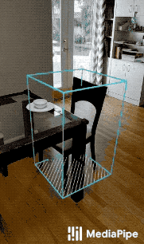
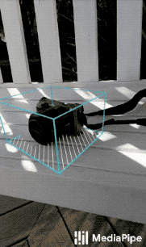
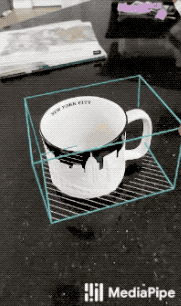
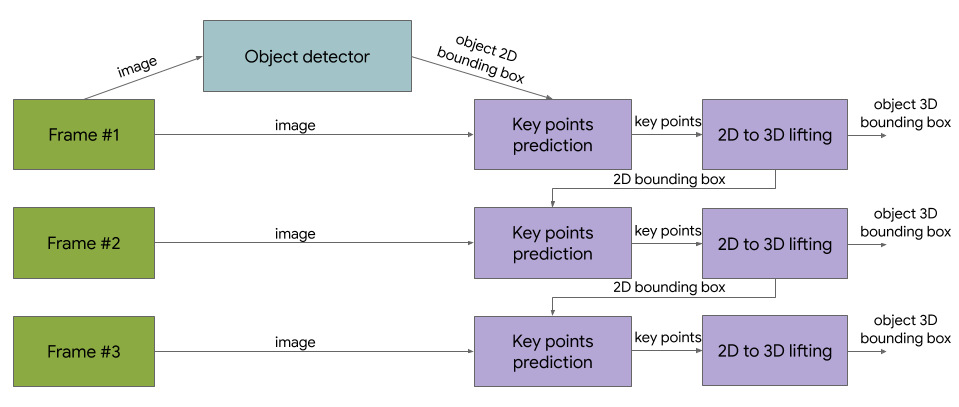
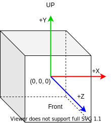
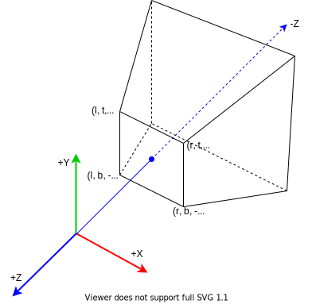
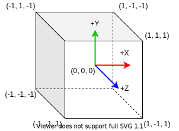

# MediaPipe Objectron
{: .no_toc }

<details close markdown="block">
  <summary>
    Table of contents
  </summary>
  {: .text-delta }
1. TOC
{:toc}
</details>
---

## Overview

MediaPipe Objectron is a mobile real-time 3D object detection solution for
everyday objects. It detects objects in 2D images, and estimates their poses
through a machine learning (ML) model, trained on the [Objectron dataset](https://github.com/google-research-datasets/Objectron).

 |  |  | 
:--------------------------------------------------------------------------------: | :----------------------------------------------------------------------------------: | :------------------------------------------------------------------------------------: | :------------------------------------------------------------------------------:
*Fig 1a. Shoe Objectron*                                                           | *Fig 1b. Chair Objectron*                                                            | *Fig 1c. Camera Objectron*                                                             | *Fig 1d. Cup Objectron*

Object detection is an extensively studied computer vision problem, but most of
the research has focused on
[2D object prediction](https://ai.googleblog.com/2017/06/supercharge-your-computer-vision-models.html).
While 2D prediction only provides 2D bounding boxes, by extending prediction to
3D, one can capture an object’s size, position and orientation in the world,
leading to a variety of applications in robotics, self-driving vehicles, image
retrieval, and augmented reality. Although 2D object detection is relatively
mature and has been widely used in the industry, 3D object detection from 2D
imagery is a challenging problem, due to the lack of data and diversity of
appearances and shapes of objects within a category.

 |
:-----------------------------------------------------------------------: |
*Fig 2. Objectron example results.*                                       |

## Obtaining Real-World 3D Training Data

While there are ample amounts of 3D data for street scenes, due to the
popularity of research into self-driving cars that rely on 3D capture sensors
like LIDAR, datasets with ground truth 3D annotations for more granular everyday
objects are extremely limited. To overcome this problem, we developed a novel
data pipeline using mobile augmented reality (AR) session data. With the arrival
of [ARCore](https://developers.google.com/ar) and
[ARKit](https://developer.apple.com/augmented-reality/),
[hundreds of millions](https://arinsider.co/2019/05/13/arcore-reaches-400-million-devices/)
of smartphones now have AR capabilities and the ability to capture additional
information during an AR session, including the camera pose, sparse 3D point
clouds, estimated lighting, and planar surfaces.

In order to label ground truth data, we built a novel annotation tool for use
with AR session data, which allows annotators to quickly label 3D bounding boxes
for objects. This tool uses a split-screen view to display 2D video frames on
which are overlaid 3D bounding boxes on the left, alongside a view showing 3D
point clouds, camera positions and detected planes on the right. Annotators draw
3D bounding boxes in the 3D view, and verify its location by reviewing the
projections in 2D video frames. For static objects, we only need to annotate an
object in a single frame and propagate its location to all frames using the
ground truth camera pose information from the AR session data, which makes the
procedure highly efficient.

|     |
| :--------------------------------------------------------------------------: |
| *Fig 3. Real-world data annotation for 3D object detection. (Right) 3D bounding boxes are annotated in the 3D world with detected surfaces and point clouds. (Left) Projections of annotated 3D bounding boxes are overlaid on top of video frames making it easy to validate the annotation.* |

## AR Synthetic Data Generation

A popular approach is to complement real-world data with synthetic data in order
to increase the accuracy of prediction. However, attempts to do so often yield
poor, unrealistic data or, in the case of photorealistic rendering, require
significant effort and compute. Our novel approach, called AR Synthetic Data
Generation, places virtual objects into scenes that have AR session data, which
allows us to leverage camera poses, detected planar surfaces, and estimated
lighting to generate placements that are physically probable and with lighting
that matches the scene. This approach results in high-quality synthetic data
with rendered objects that respect the scene geometry and fit seamlessly into
real backgrounds. By combining real-world data and AR synthetic data, we are
able to increase the accuracy by about 10%.

 |
:-------------------------------------------------------------------------------------------: |
*Fig 4. An example of AR synthetic data generation. The virtual white-brown cereal box is rendered into the real scene, next to the real blue book.* |

## ML Pipelines for 3D Object Detection

We built two ML pipelines to predict the 3D bounding box of an object from a
single RGB image: one is a two-stage pipeline and the other is a single-stage
pipeline. The two-stage pipeline is 3x faster than the single-stage pipeline
with similar or better accuracy. The single stage pipeline is good at detecting
multiple objects, whereas the two stage pipeline is good for a single dominant
object.

### Two-stage Pipeline

Our two-stage pipeline is illustrated by the diagram in Fig 5. The first stage
uses an object detector to find the 2D crop of the object. The second stage
takes the image crop and estimates the 3D bounding box. At the same time, it
also computes the 2D crop of the object for the next frame, such that the object
detector does not need to run every frame.

 |
:----------------------------------------------------------------------------------------: |
*Fig 5. Network architecture and post-processing for two-stage 3D object detection.*       |

We can use any 2D object detector for the first stage. In this solution, we use
[TensorFlow Object Detection](https://github.com/tensorflow/models/tree/master/research/object_detection) trained
with the [Open Images dataset](https://storage.googleapis.com/openimages/web/index.html).
The second stage 3D bounding box predictor we released runs 83FPS on Adreno 650
mobile GPU.

### Single-stage Pipeline

 |
:---------------------------------------------------------------------------------: |
*Fig 6. Network architecture and post-processing for single-stage 3D object detection.* |

Our [single-stage pipeline](https://arxiv.org/abs/2003.03522) is illustrated by
the diagram in Fig 6, the model backbone has an encoder-decoder architecture,
built upon
[MobileNetv2](https://ai.googleblog.com/2018/04/mobilenetv2-next-generation-of-on.html).
We employ a multi-task learning approach, jointly predicting an object's shape
with detection and regression. The shape task predicts the object's shape
signals depending on what ground truth annotation is available, e.g.
segmentation. This is optional if there is no shape annotation in training data.
For the detection task, we use the annotated bounding boxes and fit a Gaussian
to the box, with center at the box centroid, and standard deviations
proportional to the box size. The goal for detection is then to predict this
distribution with its peak representing the object’s center location. The
regression task estimates the 2D projections of the eight bounding box vertices.
To obtain the final 3D coordinates for the bounding box, we leverage a well
established pose estimation algorithm
([EPnP](https://www.epfl.ch/labs/cvlab/software/multi-view-stereo/epnp/)). It
can recover the 3D bounding box of an object, without a priori knowledge of the
object dimensions. Given the 3D bounding box, we can easily compute pose and
size of the object. The model is light enough to run real-time on mobile devices
(at 26 FPS on an Adreno 650 mobile GPU).

 |
:-------------------------------------------------------------------------------------: |
*Fig 7. Sample results of our network — (Left) original 2D image with estimated bounding boxes, (Middle) object detection by Gaussian distribution, (Right) predicted segmentation mask.* |

#### Detection and Tracking

When the model is applied to every frame captured by the mobile device, it can
suffer from jitter due to the ambiguity of the 3D bounding box estimated in each
frame. To mitigate this, we adopt the same detection+tracking strategy in our
[2D object detection and tracking pipeline](./box_tracking.md#object-detection-and-tracking)
in [MediaPipe Box Tracking](./box_tracking.md). This mitigates the need to run
the network on every frame, allowing the use of heavier and therefore more
accurate models, while keeping the pipeline real-time on mobile devices. It also
retains object identity across frames and ensures that the prediction is
temporally consistent, reducing the jitter.

The Objectron 3D object detection and tracking pipeline is implemented as a
MediaPipe
[graph](https://github.com/google/mediapipe/tree/master/mediapipe/graphs/object_detection_3d/object_occlusion_tracking_1stage.pbtxt),
which internally uses a
[detection subgraph](https://github.com/google/mediapipe/tree/master/mediapipe/modules/objectron/objectron_detection_1stage_gpu.pbtxt)
and a
[tracking subgraph](https://github.com/google/mediapipe/tree/master/mediapipe/modules/objectron/objectron_tracking_1stage_gpu.pbtxt).
The detection subgraph performs ML inference only once every few frames to
reduce computation load, and decodes the output tensor to a FrameAnnotation that
contains nine keypoints: the 3D bounding box's center and its eight vertices.
The tracking subgraph runs every frame, using the box traker in
[MediaPipe Box Tracking](./box_tracking.md) to track the 2D box tightly
enclosing the projection of the 3D bounding box, and lifts the tracked 2D
keypoints to 3D with
[EPnP](https://www.epfl.ch/labs/cvlab/software/multi-view-stereo/epnp/). When
new detection becomes available from the detection subgraph, the tracking
subgraph is also responsible for consolidation between the detection and
tracking results, based on the area of overlap.

## Objectron Dataset

We also released our [Objectron dataset](http://objectron.dev), with which we
trained our 3D object detection models. The technical details of the Objectron
dataset, including usage and tutorials, are available on
the [dataset website](https://github.com/google-research-datasets/Objectron/).

## Solution APIs

### Cross-platform Configuration Options

Naming style and availability may differ slightly across platforms/languages.

#### static_image_mode

If set to `false`, the solution treats the input images as a video stream. It
will try to detect objects in the very first images, and upon successful
detection further localizes the 3D bounding box landmarks. In subsequent images,
once all [max_num_objects](#max_num_objects) objects are detected and the
corresponding 3D bounding box landmarks are localized, it simply tracks those
landmarks without invoking another detection until it loses track of any of the
objects. This reduces latency and is ideal for processing video frames. If set
to `true`, object detection runs every input image, ideal for processing a batch
of static, possibly unrelated, images. Default to `false`.

#### max_num_objects

Maximum number of objects to detect. Default to `5`.

#### min_detection_confidence

Minimum confidence value (`[0.0, 1.0]`) from the object-detection model for the
detection to be considered successful. Default to `0.5`.

#### min_tracking_confidence

Minimum confidence value (`[0.0, 1.0]`) from the landmark-tracking model for the
3D bounding box landmarks to be considered tracked successfully, or otherwise
object detection will be invoked automatically on the next input image. Setting
it to a higher value can increase robustness of the solution, at the expense of
a higher latency. Ignored if [static_image_mode](#static_image_mode) is `true`,
where object detection simply runs on every image. Default to `0.99`.

#### model_name

Name of the model to use for predicting 3D bounding box landmarks. Currently
supports `{'Shoe', 'Chair', 'Cup', 'Camera'}`. Default to `Shoe`.

#### focal_length

By default, camera focal length defined in [NDC space](#ndc-space), i.e., `(fx,
fy)`. Default to `(1.0, 1.0)`. To specify focal length in
[pixel space](#pixel-space) instead, i.e., `(fx_pixel, fy_pixel)`, users should
provide [`image_size`](#image_size) = `(image_width, image_height)` to enable
conversions inside the API. For further details about NDC and pixel space,
please see [Coordinate Systems](#coordinate-systems).

#### principal_point

By default, camera principal point defined in [NDC space](#ndc-space), i.e.,
`(px, py)`. Default to `(0.0, 0.0)`. To specify principal point in
[pixel space](#pixel-space), i.e.,`(px_pixel, py_pixel)`, users should provide
[`image_size`](#image_size) = `(image_width, image_height)` to enable
conversions inside the API. For further details about NDC and pixel space,
please see [Coordinate Systems](#coordinate-systems).

#### image_size

**Specify only when [`focal_length`](#focal_length) and
[`principal_point`](#principal_point) are specified in pixel space.**

Size of the input image, i.e., `(image_width, image_height)`.

### Output

<!-- Naming style may differ slightly across platforms/languages. -->

#### detected_objects

A list of detected 3D bounding box. Each 3D bounding box consists of the
following:

*   `landmarks_2d` : 2D landmarks of the object's 3D bounding box. The landmark
    coordinates are normalized to `[0.0, 1.0]` by the image width and height
    respectively.

*   `landmarks_3d` : 3D landmarks of the object's 3D bounding box. The landmark
    coordinates are represented in [camera coordinate](#camera-coordinate)
    frame.

*   `rotation` : rotation matrix from object coordinate frame to camera
    coordinate frame.

*   `translation` : translation vector from object coordinate frame to camera
    coordinate frame.

*   `scale` : relative scale of the object along `x`, `y` and `z` directions.

## Python Solution API

Please first follow general [instructions](../getting_started/python.md) to
install MediaPipe Python package, then learn more in the companion
[Python Colab](#resources) and the usage example below.

Supported configuration options:

*   [static_image_mode](#static_image_mode)
*   [max_num_objects](#max_num_objects)
*   [min_detection_confidence](#min_detection_confidence)
*   [min_tracking_confidence](#min_tracking_confidence)
*   [model_name](#model_name)
*   [focal_length](#focal_length)
*   [principal_point](#principal_point)
*   [image_size](#image_size)

```python
import cv2
import mediapipe as mp
mp_drawing = mp.solutions.drawing_utils
mp_objectron = mp.solutions.objectron

# For static images:
IMAGE_FILES = []
with mp_objectron.Objectron(static_image_mode=True,
                            max_num_objects=5,
                            min_detection_confidence=0.5,
                            model_name='Shoe') as objectron:
  for idx, file in enumerate(IMAGE_FILES):
    image = cv2.imread(file)
    # Convert the BGR image to RGB and process it with MediaPipe Objectron.
    results = objectron.process(cv2.cvtColor(image, cv2.COLOR_BGR2RGB))

    # Draw box landmarks.
    if not results.detected_objects:
      print(f'No box landmarks detected on {file}')
      continue
    print(f'Box landmarks of {file}:')
    annotated_image = image.copy()
    for detected_object in results.detected_objects:
      mp_drawing.draw_landmarks(
          annotated_image, detected_object.landmarks_2d, mp_objectron.BOX_CONNECTIONS)
      mp_drawing.draw_axis(annotated_image, detected_object.rotation,
                           detected_object.translation)
      cv2.imwrite('/tmp/annotated_image' + str(idx) + '.png', annotated_image)

# For webcam input:
cap = cv2.VideoCapture(0)
with mp_objectron.Objectron(static_image_mode=False,
                            max_num_objects=5,
                            min_detection_confidence=0.5,
                            min_tracking_confidence=0.99,
                            model_name='Shoe') as objectron:
  while cap.isOpened():
    success, image = cap.read()
    if not success:
      print("Ignoring empty camera frame.")
      # If loading a video, use 'break' instead of 'continue'.
      continue

    # Convert the BGR image to RGB.
    image = cv2.cvtColor(image, cv2.COLOR_BGR2RGB)
    # To improve performance, optionally mark the image as not writeable to
    # pass by reference.
    image.flags.writeable = False
    results = objectron.process(image)

    # Draw the box landmarks on the image.
    image.flags.writeable = True
    image = cv2.cvtColor(image, cv2.COLOR_RGB2BGR)
    if results.detected_objects:
        for detected_object in results.detected_objects:
            mp_drawing.draw_landmarks(
              image, detected_object.landmarks_2d, mp_objectron.BOX_CONNECTIONS)
            mp_drawing.draw_axis(image, detected_object.rotation,
                                 detected_object.translation)
    cv2.imshow('MediaPipe Objectron', image)
    if cv2.waitKey(5) & 0xFF == 27:
      break
cap.release()
```

## JavaScript Solution API

Please first see general [introduction](../getting_started/javascript.md) on
MediaPipe in JavaScript, then learn more in the companion [web demo](#resources)
and the following usage example.

Supported configuration options:

*   [staticImageMode](#static_image_mode)
*   [maxNumObjects](#max_num_objects)
*   [minDetectionConfidence](#min_detection_confidence)
*   [minTrackingConfidence](#min_tracking_confidence)
*   [modelName](#model_name)
*   [focalLength](#focal_length)
*   [principalPoint](#principal_point)
*   [imageSize](#image_size)

```html
<!DOCTYPE html>
<html>
<head>
  <meta charset="utf-8">
  <script src="https://cdn.jsdelivr.net/npm/@mediapipe/camera_utils/camera_utils.js" crossorigin="anonymous"></script>
  <script src="https://cdn.jsdelivr.net/npm/@mediapipe/control_utils/control_utils.js" crossorigin="anonymous"></script>
  <script src="https://cdn.jsdelivr.net/npm/@mediapipe/drawing_utils/control_utils_3d.js" crossorigin="anonymous"></script>
  <script src="https://cdn.jsdelivr.net/npm/@mediapipe/drawing_utils/drawing_utils.js" crossorigin="anonymous"></script>
  <script src="https://cdn.jsdelivr.net/npm/@mediapipe/objectron/objectron.js" crossorigin="anonymous"></script>
</head>

<body>
  <div class="container">
    <video class="input_video"></video>
    <canvas class="output_canvas" width="1280px" height="720px"></canvas>
  </div>
</body>
</html>
```

```javascript
<script type="module">
const videoElement = document.getElementsByClassName('input_video')[0];
const canvasElement = document.getElementsByClassName('output_canvas')[0];
const canvasCtx = canvasElement.getContext('2d');

function onResults(results) {
  canvasCtx.save();
  canvasCtx.drawImage(
      results.image, 0, 0, canvasElement.width, canvasElement.height);
  if (!!results.objectDetections) {
    for (const detectedObject of results.objectDetections) {
      // Reformat keypoint information as landmarks, for easy drawing.
      const landmarks: mpObjectron.Point2D[] =
          detectedObject.keypoints.map(x => x.point2d);
      // Draw bounding box.
      drawingUtils.drawConnectors(canvasCtx, landmarks,
          mpObjectron.BOX_CONNECTIONS, {color: '#FF0000'});
      // Draw centroid.
      drawingUtils.drawLandmarks(canvasCtx, [landmarks[0]], {color: '#FFFFFF'});
    }
  }
  canvasCtx.restore();
}

const objectron = new Objectron({locateFile: (file) => {
  return `https://cdn.jsdelivr.net/npm/@mediapipe/objectron/${file}`;
}});
objectron.setOptions({
  modelName: 'Chair',
  maxNumObjects: 3,
});
objectron.onResults(onResults);

const camera = new Camera(videoElement, {
  onFrame: async () => {
    await objectron.send({image: videoElement});
  },
  width: 1280,
  height: 720
});
camera.start();
</script>
```

## Example Apps

Please first see general instructions for
[Android](../getting_started/android.md), [iOS](../getting_started/ios.md), and
[desktop](../getting_started/cpp.md) on how to build MediaPipe examples.

Note: To visualize a graph, copy the graph and paste it into
[MediaPipe Visualizer](https://viz.mediapipe.dev/). For more information on how
to visualize its associated subgraphs, please see
[visualizer documentation](../tools/visualizer.md).

### Mobile

#### Two-stage Objectron

*   Graph:
    [`mediapipe/graphs/object_detection_3d/object_occlusion_tracking.pbtxt`](https://github.com/google/mediapipe/tree/master/mediapipe/graphs/object_detection_3d/object_occlusion_tracking.pbtxt)

*   Android target:
    [`mediapipe/examples/android/src/java/com/google/mediapipe/apps/objectdetection3d:objectdetection3d`](https://github.com/google/mediapipe/tree/master/mediapipe/examples/android/src/java/com/google/mediapipe/apps/objectdetection3d/BUILD).

    Build for **shoes** (default) with:
    [(or download prebuilt ARM64 APK)](https://drive.google.com/file/d/1ANW9WDOCb8QO1r8gDC03A4UgrPkICdPP/view?usp=sharing)

    ```bash
    bazel build -c opt --config android_arm64 mediapipe/examples/android/src/java/com/google/mediapipe/apps/objectdetection3d:objectdetection3d
    ```

    Build for **chairs** with:
    [(or download prebuilt ARM64 APK)](https://drive.google.com/file/d/1lcUv1TBnv_SxnKSQwdOqbdLa9mkaTJHy/view?usp=sharing)

    ```bash
    bazel build -c opt --config android_arm64 --define chair=true mediapipe/examples/android/src/java/com/google/mediapipe/apps/objectdetection3d:objectdetection3d
    ```

    Build for **cups** with:
    [(or download prebuilt ARM64 APK)](https://drive.google.com/file/d/1bf77KDkowwrduleiC9B1M1XnEhjnOQbX/view?usp=sharing)

    ```bash
    bazel build -c opt --config android_arm64 --define cup=true mediapipe/examples/android/src/java/com/google/mediapipe/apps/objectdetection3d:objectdetection3d
    ```

    Build for **cameras** with:
    [(or download prebuilt ARM64 APK)](https://drive.google.com/file/d/1GM7lPO-s5URVxIzQur1bLsionEJs3yIl/view?usp=sharing)

    ```bash
    bazel build -c opt --config android_arm64 --define camera=true mediapipe/examples/android/src/java/com/google/mediapipe/apps/objectdetection3d:objectdetection3d
    ```

*   iOS target: Not available

#### Single-stage Objectron

*   Graph:
    [`mediapipe/graphs/object_detection_3d/object_occlusion_tracking_1stage.pbtxt`](https://github.com/google/mediapipe/tree/master/mediapipe/graphs/object_detection_3d/object_occlusion_tracking.pbtxt)

*   Android target:
    [`mediapipe/examples/android/src/java/com/google/mediapipe/apps/objectdetection3d:objectdetection3d`](https://github.com/google/mediapipe/tree/master/mediapipe/examples/android/src/java/com/google/mediapipe/apps/objectdetection3d/BUILD).

    Build with **single-stage** model for **shoes** with:
    [(or download prebuilt ARM64 APK)](https://drive.google.com/file/d/1MvaEg4dkvKN8jAU1Z2GtudyXi1rQHYsE/view?usp=sharing)

    ```bash
    bazel build -c opt --config android_arm64 --define shoe_1stage=true mediapipe/examples/android/src/java/com/google/mediapipe/apps/objectdetection3d:objectdetection3d
    ```

    Build with **single-stage** model for **chairs** with:
    [(or download prebuilt ARM64 APK)](https://drive.google.com/file/d/1GJL4z3jr-wD1jMHGd4NBfOG-Yoq5t167/view?usp=sharing)

    ```bash
    bazel build -c opt --config android_arm64 --define chair_1stage=true mediapipe/examples/android/src/java/com/google/mediapipe/apps/objectdetection3d:objectdetection3d
    ```

*   iOS target: Not available

#### Assets

Example app bounding boxes are rendered with [GlAnimationOverlayCalculator](https://github.com/google/mediapipe/tree/master/mediapipe/graphs/object_detection_3d/calculators/gl_animation_overlay_calculator.cc) using a parsing of the sequenced .obj file
 format into a custom .uuu format. This can be done for user assets as follows:
> First run
>
> ```shell
> ./mediapipe/graphs/object_detection_3d/obj_parser/obj_cleanup.sh [INPUT_DIR] [INTERMEDIATE_OUTPUT_DIR]
> ```
> and then run
>
> ```build
> bazel run -c opt mediapipe/graphs/object_detection_3d/obj_parser:ObjParser -- input_dir=[INTERMEDIATE_OUTPUT_DIR] output_dir=[OUTPUT_DIR]
> ```
> INPUT_DIR should be the folder with initial asset .obj files to be processed,
> and OUTPUT_DIR is the folder where the processed asset .uuu file will be placed.
>
> Note: ObjParser combines all .obj files found in the given directory into a
> single .uuu animation file, using the order given by sorting the filenames alphanumerically. Also the ObjParser directory inputs must be given as
> absolute paths, not relative paths. See parser utility library at [`mediapipe/graphs/object_detection_3d/obj_parser/`](https://github.com/google/mediapipe/tree/master/mediapipe/graphs/object_detection_3d/obj_parser/) for more details.


### Desktop

To build the application, run:

```bash
bazel build -c opt --define MEDIAPIPE_DISABLE_GPU=1 mediapipe/examples/desktop/object_detection_3d:objectron_cpu
```

To run the application, replace `<input video path>` and `<output video path>`
in the command below with your own paths, and `<landmark model path>` and
`<allowed labels>` with the following:

Category | `<landmark model path>`                                                     | `<allowed labels>`
:------- | :-------------------------------------------------------------------------- | :-----------------
Shoe     | mediapipe/modules/objectron/object_detection_3d_sneakers.tflite | Footwear
Chair    | mediapipe/modules/objectron/object_detection_3d_chair.tflite    | Chair
Cup      | mediapipe/modules/objectron/object_detection_3d_cup.tflite      | Mug
Camera   | mediapipe/modules/objectron/object_detection_3d_camera.tflite   | Camera

```
GLOG_logtostderr=1 bazel-bin/mediapipe/examples/desktop/object_detection_3d/objectron_cpu \
  --calculator_graph_config_file=mediapipe/graphs/object_detection_3d/objectron_desktop_cpu.pbtxt \
  --input_side_packets=input_video_path=<input video path>,output_video_path=<output video path>,box_landmark_model_path=<landmark model path>,allowed_labels=<allowed labels>
```

## Coordinate Systems

### Object Coordinate

Each object has its object coordinate frame. We use the below object coordinate
definition, with `+x` pointing right, `+y` pointing up and `+z` pointing front,
origin is at the center of the 3D bounding box.



### Camera Coordinate

A 3D object is parameterized by its `scale` and `rotation`, `translation` with
regard to the camera coordinate frame. In this API we use the below camera
coordinate definition, with `+x` pointing right, `+y` pointing up and `-z`
pointing to the scene.



To work with box landmarks, one can first derive landmark coordinates in object
frame by scaling a origin centered unit box with `scale`, then transform to
camera frame by applying `rotation` and `translation`:

```
landmarks_3d = rotation * scale * unit_box + translation
```

### NDC Space

In this API we use
[NDC(normalized device coordinates)](http://www.songho.ca/opengl/gl_projectionmatrix.html)
as an intermediate space when projecting points from 3D to 2D. In NDC space,
`x`, `y` are confined to `[-1, 1]`.



By default the camera parameters `(fx, fy)` and `(px, py)` are defined in NDC
space. Given `(X, Y, Z)` of 3D points in camera coordinate, one can project 3D
points to NDC space as follows:

```
x_ndc = -fx * X / Z + px
y_ndc = -fy * Y / Z + py
z_ndc = 1 / Z
```

### Pixel Space

In this API we set upper-left coner of an image as the origin of pixel
coordinate. One can convert from NDC to pixel space as follows:

```
x_pixel = (1 + x_ndc) / 2.0 * image_width
y_pixel = (1 - y_ndc) / 2.0 * image_height
```

Alternatively one can directly project from camera coordinate to pixel
coordinate with camera parameters `(fx_pixel, fy_pixel)` and `(px_pixel,
py_pixel)` defined in pixel space as follows:

```
x_pixel = -fx_pixel * X / Z + px_pixel
y_pixel =  fy_pixel * Y / Z + py_pixel
```

Conversion of camera parameters from pixel space to NDC space:

```
fx = fx_pixel * 2.0 / image_width
fy = fy_pixel * 2.0 / image_height
```

```
px = -px_pixel * 2.0 / image_width  + 1.0
py = -py_pixel * 2.0 / image_height + 1.0
```

## Resources

*   Google AI Blog:
    [Announcing the Objectron Dataset](https://ai.googleblog.com/2020/11/announcing-objectron-dataset.html)
*   Google AI Blog:
    [Real-Time 3D Object Detection on Mobile Devices with MediaPipe](https://ai.googleblog.com/2020/03/real-time-3d-object-detection-on-mobile.html)
*   Paper: [Objectron: A Large Scale Dataset of Object-Centric Videos in the
    Wild with Pose Annotations](https://arxiv.org/abs/2012.09988), to appear in
    CVPR 2021
*   Paper: [MobilePose: Real-Time Pose Estimation for Unseen Objects with Weak
    Shape Supervision](https://arxiv.org/abs/2003.03522)
*   Paper:
    [Instant 3D Object Tracking with Applications in Augmented Reality](https://drive.google.com/open?id=1O_zHmlgXIzAdKljp20U_JUkEHOGG52R8)
    ([presentation](https://www.youtube.com/watch?v=9ndF1AIo7h0)), Fourth
    Workshop on Computer Vision for AR/VR, CVPR 2020
*   [Models and model cards](./models.md#objectron)
*   [Web demo](https://code.mediapipe.dev/codepen/objectron)
*   [Python Colab](https://mediapipe.page.link/objectron_py_colab)
