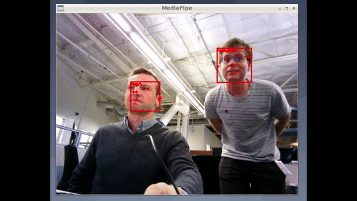

# Coral Dev Board Setup (experimental)

**Disclaimer**: Running MediaPipe on Coral is experimental, and this process may
not be exact and is subject to change. These instructions have only been tested
on the [Coral Dev Board](https://coral.ai/products/dev-board/)
running [Mendel Enterprise Day 13](https://coral.ai/software/) OS and
using [Diploria2](https://github.com/google-coral/edgetpu/tree/diploria2)
edgetpu libs, and may vary for different devices and workstations.

This file describes how to prepare a Coral Dev Board and setup a Linux
Docker container for building MediaPipe applications that run on Edge TPU.

## Before creating the Docker

* (on host machine) run _setup.sh_ from MediaPipe root directory

        sh mediapipe/examples/coral/setup.sh

* Setup the coral device via [here](https://coral.withgoogle.com/docs/dev-board/get-started/), and ensure the _mdt_ command works

        Note:   alias mdt="python3 -m mdt.main"    may be needed on some systems

* (on coral device) prepare MediaPipe

        cd ~
        sudo apt-get update && sudo apt-get install -y git
        git clone https://github.com/google/mediapipe.git
        mkdir mediapipe/bazel-bin

* (on coral device) install opencv 3.2

        sudo apt-get update && sudo apt-get install -y libopencv-dev

* (on coral device) find all opencv libs

        find /usr/lib/aarch64-linux-gnu/ -name 'libopencv*so'

* (on host machine) copy core opencv libs from coral device to a local folder inside MediaPipe checkout:

        # in root level mediapipe folder #
        mdt pull /usr/lib/aarch64-linux-gnu/libopencv_core.so opencv32_arm64_libs
        mdt pull /usr/lib/aarch64-linux-gnu/libopencv_calib3d.so opencv32_arm64_libs
        mdt pull /usr/lib/aarch64-linux-gnu/libopencv_features2d.so opencv32_arm64_libs
        mdt pull /usr/lib/aarch64-linux-gnu/libopencv_highgui.so opencv32_arm64_libs
        mdt pull /usr/lib/aarch64-linux-gnu/libopencv_imgcodecs.so opencv32_arm64_libs
        mdt pull /usr/lib/aarch64-linux-gnu/libopencv_imgproc.so opencv32_arm64_libs
        mdt pull /usr/lib/aarch64-linux-gnu/libopencv_video.so opencv32_arm64_libs
        mdt pull /usr/lib/aarch64-linux-gnu/libopencv_videoio.so opencv32_arm64_libs

* (on host machine) Create and start the docker environment

        # from mediapipe root level directory #
        docker build -t coral .
        docker run -it --name coral coral:latest

## Inside the Docker environment

* Update library paths in /mediapipe/third_party/opencv_linux.BUILD

  (replace 'x86_64-linux-gnu' with 'aarch64-linux-gnu')

        "lib/aarch64-linux-gnu/libopencv_core.so",
        "lib/aarch64-linux-gnu/libopencv_calib3d.so",
        "lib/aarch64-linux-gnu/libopencv_features2d.so",
        "lib/aarch64-linux-gnu/libopencv_highgui.so",
        "lib/aarch64-linux-gnu/libopencv_imgcodecs.so",
        "lib/aarch64-linux-gnu/libopencv_imgproc.so",
        "lib/aarch64-linux-gnu/libopencv_video.so",
        "lib/aarch64-linux-gnu/libopencv_videoio.so",

* Attempt to build hello world (to download external deps)

        bazel build -c opt --define MEDIAPIPE_DISABLE_GPU=1 mediapipe/examples/desktop/hello_world:hello_world

* Edit /edgetpu/libedgetpu/BUILD

     to add this build target

         cc_library(
             name = "lib",
             srcs = [
                 "libedgetpu.so",
             ],
             visibility = ["//visibility:public"],
         )

* Edit /edgetpu/WORKSPACE

     update /mediapipe/WORKSPACE TENSORFLOW_* variables to match what /edgetpu/WORKSPACE has:

        grep TENSORFLOW_ /mediapipe/WORKSPACE
        grep TENSORFLOW_ /edgetpu/WORKSPACE

        # Make sure the /mediapipe/WORKSPACE  _TENSORFLOW_GIT_COMMIT  and  _TENSORFLOW_SHA256
        #   match the /edgetpu/WORKSPACE  TENSORFLOW_COMMIT  and  TENSORFLOW_SHA256  respectively.

        # If they do not match, modify /mediapipe/WORKSPACE to match what /edgetpu/WORKSPACE has.
        # Also comment out the MediaPipe org_tensorflow patch section.

* Edit /mediapipe/mediapipe/calculators/tflite/BUILD to change rules for *tflite_inference_calculator.cc*

        sed -i 's/\":tflite_inference_calculator_cc_proto\",/\":tflite_inference_calculator_cc_proto\",\n\t\"@edgetpu\/\/:header\",\n\t\"@libedgetpu\/\/:lib\",/g' /mediapipe/mediapipe/calculators/tflite/BUILD

      The above command should add

        "@edgetpu//:header",
        "@libedgetpu//:lib",

      to the _deps_ of tflite_inference_calculator.cc

      Now also remove XNNPACK deps:

        sed -i 's/\"@org_tensorflow\/\/tensorflow\/lite\/delegates\/xnnpack/#\"@org_tensorflow\/\/tensorflow\/lite\/delegates\/xnnpack/g' /mediapipe/mediapipe/calculators/tflite/BUILD

#### Now try cross-compiling for device

* Object detection demo

        bazel build -c opt --crosstool_top=@crosstool//:toolchains --compiler=gcc --cpu=aarch64 --define MEDIAPIPE_DISABLE_GPU=1 --copt -DMEDIAPIPE_EDGE_TPU --copt=-flax-vector-conversions mediapipe/examples/coral:object_detection_tpu

 Copy object_detection_tpu binary to the MediaPipe checkout on the coral device

        # outside docker env, open new terminal on host machine #
        docker ps
        docker cp <container-id>:/mediapipe/bazel-bin/mediapipe/examples/coral/object_detection_tpu /tmp/.
        mdt push /tmp/object_detection_tpu /home/mendel/mediapipe/bazel-bin/.

* Face detection demo

        bazel build -c opt --crosstool_top=@crosstool//:toolchains --compiler=gcc --cpu=aarch64 --define MEDIAPIPE_DISABLE_GPU=1 --copt -DMEDIAPIPE_EDGE_TPU --copt=-flax-vector-conversions mediapipe/examples/coral:face_detection_tpu

 Copy face_detection_tpu binary to the MediaPipe checkout on the coral device

        # outside docker env, open new terminal on host machine #
        docker ps
        docker cp <container-id>:/mediapipe/bazel-bin/mediapipe/examples/coral/face_detection_tpu /tmp/.
        mdt push /tmp/face_detection_tpu /home/mendel/mediapipe/bazel-bin/.

## On the coral device (with display)

     # Object detection
     cd ~/mediapipe
     chmod +x bazel-bin/object_detection_tpu
     export GLOG_logtostderr=1
     bazel-bin/object_detection_tpu --calculator_graph_config_file=mediapipe/examples/coral/graphs/object_detection_desktop_live.pbtxt

     # Face detection
     cd ~/mediapipe
     chmod +x bazel-bin/face_detection_tpu
     export GLOG_logtostderr=1
     bazel-bin/face_detection_tpu --calculator_graph_config_file=mediapipe/examples/coral/graphs/face_detection_desktop_live.pbtxt

